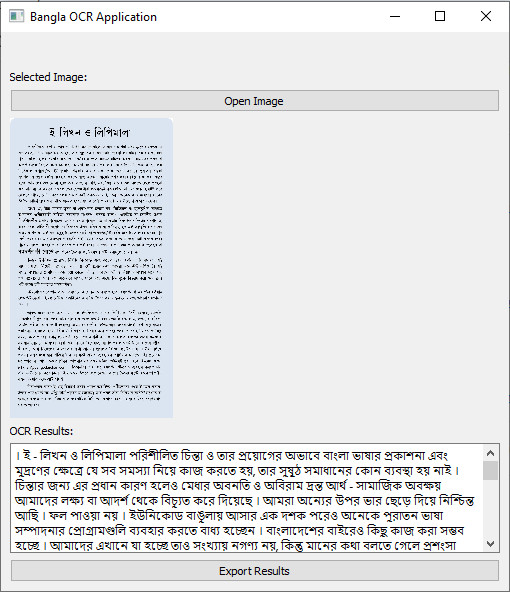

# Bangla OCR Application



An Optical Character Recognition (OCR) application for Bangla image to text conversion.

## Features

- 📖 Accurate Bangla text extraction from images/PDFs
- ✍️ BERT-based text correction
- 🖼️ Supports PNG, JPG, PDF formats

## Installation

### Windows Executable
1. Download the latest release from [Releases]()
2. Run `BanglaOCR.exe`

### From Source
```bash
# Clone repository
git clone https://github.com/yourusername/bangla-ocr.git
cd bangla-ocr

# Install dependencies
pip install -r requirements.txt

# Run application
python main.py
```

## Usage
1. Click "Open Image" to select a file
4. Export results and save as text or word file

## Building from Source
```bash
# Install PyInstaller
pip install pyinstaller

# Build executable
python build.py
```

## Requirements
- Python 3.12
- Tesseract OCR 5.x
- 4GB+ RAM (8GB recommended for BERT model)

## License
MIT © 2025 Bangla OCR
